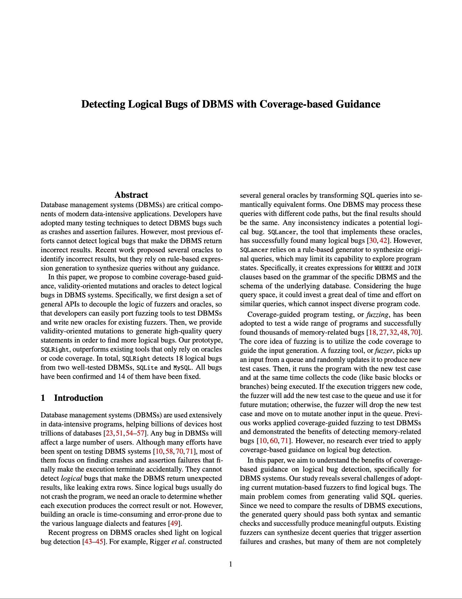

# sqlright-artifact: The code, analysis scripts and results for USENIX 2022 Artifact Evaluation

<a href="Paper/paper_no_names.pdf"></a>

Version: 1.0\
Update: May 24, 2022
Paper: Detecting Logical Bugs of DBMS with Coverage-based Guidance

This document is to help users reproduce the results we reported in our submission. 

Currently supported DBMS:
1. SQLite3
2. PostgreSQL
3. MySQL

<br/><br/>
## Getting Started

### Operating System configuration and Source Code setup

All of the experiments are evaluated on a `X86-64` CPU with `Ubuntu 20.04 LTS` operating system. We recommand more than `500GB` of memory for the evaluation and `1TB` hard drive storage usage. All the experiments are evaluated in a Docker env, we recommend to use Docker version >= `20.10.16` to reproduce the results. Before the start of the experiment, we need to configure a few system settings to be applied to the host operating system. 

```sh
# Open a terminal from the Ubuntu system if you are using a Desktop distribution. 
sudo apt-get install build-essential libreadline-dev zlib1g-dev flex bison libxml2-dev libxslt-dev libssl-dev libxml2-utils xsltproc
sudo apt-get install -y libpq-dev

# Disable On-demand CPU scaling
cd /sys/devices/system/cpu
echo performance | sudo tee cpu*/cpufreq/scaling_governor

# Avoid having crashes being misinterpreted as hangs
sudo sh -c " echo core >/proc/sys/kernel/core_pattern "
```

Since the operating system will automatically reset some settings, we need to reset the system settgings using the above script every time the computer is being restarted. If the system settings are not setup correctly, the fuzzing process inside Docker will be failed to run. 

We will use some python3 script to generate the plots. Therefore, we should install some python3 dependencies in the host operating system. 
```sh
sudo apt-get install python3
sudo apt-get install python3-pip

# Use root to run pip3 if necessary. 
pip3 install matplotlib
pip3 install numpy
pip3 install pandas
pip3 install paramiko
```

And then, go to the path where you want to dump the sqlright source code:

```sh
cd ~ # Assuming the home directory
git clone git@github.com:PSU-Security-Universe/sqlright-artifact.git  # TODO: May refer to other link if we are using Zenodo. 
```

<br/><br/>
## 0. Artifact Expectation

The total Artifact Evaluation is expected to consume a total of `#TODO` CPU hours. We recommend using a machine with >= `20` cores of CPU, `500GB` of memory and `1TB` of storage space to reproduce the results. The code and the scripts of our built tool `SQLRight` are being released in this repository. Using the instructions below, one should be able to reproduce all the evaluations (Figures, Tables) shown in our Final Paper. 


<br/><br/>
## 1. Artifact Overview

Our paper presents `SQLRight`, a tool that combines coverage-based guidance, validity-oriented mutations and oracles to detect logical bugs in Database Management Systems. For Artifact Evaluation, we release:

- (1) The `SQLRight` source code. 
- (2) The paper's final version. [Paper Link in Repo](Paper/paper_no_names.pdf)
- (3) Information and the script to reproduce the evaluated benchmarks. 

**Session 2** contains the instructions to build all the Docker images required for our evaluation. These are the prerequisite steps before we run any fuzzing evaluations. 

**Session 3** contains the instructions to evaluate `Comparison with Existing Tools` (**Section 5.2** in the paper). It includes the steps to generate the figures from *Figure 5* and *Figure 8* in the paper. It consumes about `#TODO` CPU hours.

**Session 4** contains the instructions to evaluate `Contribution of Coverage Feedback` (**Section 5.3** in the paper). It includes the steps to generate *Figure 6* and *Table 3* in the paper. It consumes about `#TODO` CPU hours.

**Session 5** contains the instructions to evalute `Contribution of Validity` (**Section 5.4** in the paper). It includes the steps to generate *Figure 7*, *Figure 9* and *Table 4* in the paper. It consumes about `#TODO` CPU hours.


<br/><br/>
## 2. Build the Docker environment to run the evaluations

### Build the Docker image for SQLite3 evaluations. 

Execute the following command before running any SQLite3 related evaluations. 

The Docker build process can last for about `1` hour. Expect long runtime when executing the commands. 
```sh
cd <sqlright_root>/SQLite/scripts/
bash setup_sqlite.sh
```

After the command finihsed, a Docker Image named `sqlright_sqlite` is created. 

### Building the Docker image that contains the PostgreSQL fuzzing scripts.

Execute the following command before running any PostgreSQL related evaluations. 

The Docker build process can last for about `1` hour. Expect long runtime when executing the commands. 
```sh
cd <sqlright_root>/PostgreSQL/scripts/
bash setup_postgres.sh
```

After the command finihsed, a Docker Image named `sqlright_postgres` is created. 

### Building the Docker image that contains the MySQL fuzzing scripts.

Execute the following command before running any PostgreSQL related evaluations. 

The Docker build process can last for about `3` hour. Expect long runtime when executing the commands. The created Docker Image will have around `70GB` of storage space. 
```sh
cd <sqlright_root>/MySQL/scripts/
bash setup_mysql.sh
bash setup_mysql_bisecting.sh
```

After the command finihsed, a Docker Image named `sqlright_mysql` is created. 

<br/><br/>
## 3. Comparison between different tools:

### 3.1 SQLite, NoREC oracle (Figure 6c, f, i)

#### 3.1.1 Run the SQLRight SQLite3 fuzzing for 72 hours.

Explanation of the command:

The `start-core` flag binds the fuzzing process to the specific CPU core. 

The `num-concurrent` flag determines the number of concurrent fuzzing processes. 

The `oracle` flag determines the oracle used for the fuzzing. Current supported: `NOREC` and `TLP`. 

```sh
cd <sqlright_root>/SQLite/scripts
bash run_sqlite_fuzzing.sh SQLRight --start-core 0 --num-concurrent 5 --oracle NOREC
```

#### 3.1.2 Run the Squirrel SQLite3 fuzzing for 72 hours. 

```sh
cd <sqlright_root>/SQLite/scripts
bash run_sqlite_fuzzing.sh squirrel-oracle --start-core 0 --num-concurrent 5 --oracle NOREC
```

#### 3.1.3 Run the SQLancer SQLite3 for 72 hours. 

```sh
cd <sqlright_root>/SQLite/scripts
bash run_sqlite_fuzzing.sh sqlancer --num-concurrent 5 --oracle NOREC
```

#### 3.1.4 Plot the figures. 

```sh
cd <sqlright_root>/Plot_Scripts/SQLite3/NoREC/Comp_diff_tools_NoREC
python3 copy_results.py
python3 run_plots.py
```

The plots would be generated in folder `plots`.

### 3.2 PostgreSQL, NoREC oracle (Figure 6d, g, j)

#### 3.2.1 Run the SQLRight PostgreSQL fuzzing for 72 hours. 

```sh
cd <sqlright_root>/PostgreSQL/scripts
bash run_postgres_fuzzing.sh SQLRight --start-core 0 --num-concurrent 5 --oracle NOREC
```

#### 3.2.2 Run the Squirrel with oracle PostgreSQL fuzzing for 72 hours.

```sh
cd <sqlright_root>/PostgreSQL/scripts
bash run_postgres_fuzzing.sh squirrel-oracle --start-core 0 --num-concurrent 5 --oracle NOREC
```

#### 3.2.3 Run the SQLancer PostgreSQL for 72 hours.

```sh
cd <sqlright_root>/PostgreSQL/scripts
bash run_postgres_fuzzing.sh sqlancer --num-concurrent 5 --oracle NOREC
```

#### 3.2.4 Plot the figures. 

```sh
cd <sqlright_root>/Plot_Scripts/Postgres/NoREC/Comp_diff_tools_NoREC
python3 copy_results.py
python3 run_plots.py
```

The plots would be generated in folder `plots`.

### 3.3 MySQL, NoREC oracle (Figure 6d, g, j)

#### 3.3.1 Run the SQLRight MySQL fuzzing for 72 hours. 

```sh
cd <sqlright_root>/MySQL/scripts
bash run_mysql_fuzzing.sh SQLRight --start-core 0 --num-concurrent 5 --oracle NOREC
```

#### 3.3.2 Run the Squirrel with oracle MySQL fuzzing for 72 hours.

```sh
cd <sqlright_root>/MySQL/scripts
bash run_mysql_fuzzing.sh squirrel-oracle --start-core 0 --num-concurrent 5 --oracle NOREC
```

#### 3.3.3 Plot the figures. 

```sh
cd <sqlright_root>/Plot_Scripts/MySQL/NoREC/Comp_diff_tools
python3 copy_results.py
python3 run_plots.py
```

### 3.4 SQLite, TLP oracle (Figure 9c, f, i)

#### 3.4.1 Run the SQLRight SQLite3 fuzzing for 72 hours.

```sh
cd <sqlright_root>/SQLite/scripts
bash run_sqlite_fuzzing.sh SQLRight --start-core 0 --num-concurrent 5 --oracle TLP
```

#### 3.4.2 Run the Squirrel SQLite3 fuzzing for 72 hours. 

```sh
cd <sqlright_root>/SQLite/scripts
bash run_sqlite_fuzzing.sh squirrel-oracle --start-core 0 --num-concurrent 5 --oracle TLP
```

#### 3.4.3 Run the SQLancer SQLite3 for 72 hours. 

```sh
cd <sqlright_root>/SQLite/scripts
bash run_sqlite_fuzzing.sh sqlancer --num-concurrent 5 --oracle TLP
```

#### 3.4.4 Plot the figures. 

```sh
cd <sqlright_root>/Plot_Scripts/SQLite3/TLP/Comp_diff_tool
python3 copy_results.py
python3 run_plots.py
```

The plots would be generated in folder `plots`.

### 3.5 PostgreSQL, TLP oracle (Figure 9d, g, j)

#### 3.5.1 Run the SQLRight PostgreSQL fuzzing for 72 hours. 

```sh
cd <sqlright_root>/PostgreSQL/scripts
bash run_postgres_fuzzing.sh SQLRight --start-core 0 --num-concurrent 5 --oracle TLP
```

#### 3.5.2 Run the Squirrel with oracle PostgreSQL fuzzing for 72 hours.

```sh
cd <sqlright_root>/PostgreSQL/scripts
bash run_postgres_fuzzing.sh squirrel-oracle --start-core 0 --num-concurrent 5 --oracle TLP
```

#### 3.5.3 Run the SQLancer PostgreSQL for 72 hours.

```sh
cd <sqlright_root>/PostgreSQL/scripts
bash run_postgres_fuzzing.sh sqlancer --num-concurrent 5 --oracle TLP
```

#### 3.5.4 Plot the figures. 

```sh
cd <sqlright_root>/Plot_Scripts/Postgres/TLP/Comp_diff_tools_TLP
python3 copy_results.py
python3 run_plots.py
```

The plots would be generated in folder `plots`.

### 3.6 MySQL, NoREC oracle (Figure 9d, g, j)

#### 3.6.1 Run the SQLRight MySQL fuzzing for 72 hours. 

```sh
cd <sqlright_root>/MySQL/scripts
bash run_mysql_fuzzing.sh SQLRight --start-core 0 --num-concurrent 5 --oracle TLP
```

#### 3.6.2 Run the Squirrel with oracle MySQL fuzzing for 72 hours.

```sh
cd <sqlright_root>/MySQL/scripts
bash run_mysql_fuzzing.sh squirrel-oracle --start-core 0 --num-concurrent 5 --oracle TLP
```

#### 3.6.3 Run the SQLancer MySQL for 72 hours.

```sh
cd <sqlright_root>/MySQL/scripts
bash run_mysql_fuzzing.sh sqlancer --num-concurrent 5 --oracle TLP
```

#### 3.6.4 Plot the figures. 

```sh
cd <sqlright_root>/Plot_Scripts/MySQL/TLP/Comp_diff_tools
python3 copy_results.py
python3 run_plots.py
```

## 4. Contribution of code-coverage feedback:

### 4.1 Using NoREC oracle (Figure 6c):

#### 4.1.1 Run the SQLRight SQLite3 Drop All configiguration, for 24 hours:
```sh
cd <sqlright_root>/SQLite/scripts
bash run_sqlite_fuzzing.sh SQLRight --start-core 0 --num-concurrent 5 --oracle NOREC --feedback drop_all 
```

#### 4.1.2 Run the SQLRight SQLite3 Random Save configiguration, for 24 hours:
```sh
cd <sqlright_root>/SQLite/scripts
bash run_sqlite_fuzzing.sh SQLRight --start-core 0 --num-concurrent 5 --oracle NOREC --feedback random_save
```

#### 4.1.3 Run the SQLRight SQLite3 Save All configiguration, for 24 hours:
```sh
cd <sqlright_root>/SQLite/scripts
bash run_sqlite_fuzzing.sh SQLRight --start-core 0 --num-concurrent 5 --oracle NOREC --feedback save_all
```

#### 4.1.4 Plot the figures:
```sh
cd <sqlright_root>/Plot_Scripts/SQLite3/NoREC/Feedback_Test
python3 copy_results.py
python3 run_plots.py
```

### 4.2 Using TLP oracle (Figure 6d):

#### 4.2.1 Run the SQLRight SQLite3 Drop All configiguration, for 24 hours:
```sh
cd <sqlright_root>/SQLite/scripts
bash run_sqlite_fuzzing.sh SQLRight --start-core 0 --num-concurrent 5 --oracle TLP --feedback drop_all 
```

#### 4.2.2 Run the SQLRight SQLite3 Random Save configiguration, for 24 hours:
```sh
cd <sqlright_root>/SQLite/scripts
bash run_sqlite_fuzzing.sh SQLRight --start-core 0 --num-concurrent 5 --oracle TLP --feedback random_save
```

#### 4.2.3 Run the SQLRight SQLite3 Save All configiguration, for 24 hours:
```sh
cd <sqlright_root>/SQLite/scripts
bash run_sqlite_fuzzing.sh SQLRight --start-core 0 --num-concurrent 5 --oracle TLP --feedback save_all
```

#### 4.2.4 Plot the figures:
```sh
cd <sqlright_root>/Plot_Scripts/SQLite3/TLP/Feedback_Test
python3 copy_results.py
python3 run_plots.py
```

## 5. Contribution of Validity components:

### 5.1 SQLite, NoREC oracle (Figure 7c, f, i):

#### 5.1.1 Run the SQLRight SQLite3 fuzzing for 24 hours. 

This evaluation is the same as the one in session `3.1.1`. We can reuse the evaluation results. 

#### 5.1.2 Run the SQLRight no-ctx-valid fuzzing for 24 hours. 

Run

```sh
cd <sqlright_root>/SQLite/scripts
bash run_sqlite_fuzzing.sh no-ctx-valid --start-core 0 --num-concurrent 5 --oracle NOREC
```

#### 5.1.3 Run the SQLRight no-db-par-ctx-valid fuzzing for 24 hours. 

Run

```sh
cd <sqlright_root>/SQLite/scripts
bash run_sqlite_fuzzing.sh no-db-par-ctx-valid --start-core 0 --num-concurrent 5 --oracle NOREC
```

#### 5.1.4 Run the Squirrel-oracle fuzzing for 24 hours. 

Run

```sh
cd <sqlright_root>/SQLite/scripts
bash run_sqlite_fuzzing.sh squirrel-oracle --start-core 0 --num-concurrent 5 --oracle NOREC
```

#### 5.1.5 Plot the figures:

```sh
cd <sqlright_root>/Plot_Scripts/SQLite3/NoREC/Validate_Parts
python3 copy_results.py
python3 run_plots.py
```

### 5.2 PostgreSQL, NoREC oracle (Figure 7e, h, k):

#### 5.2.1 Run the SQLRight PostgreSQL fuzzing for 24 hours. 

This evaluation is the same as the one in session `3.2.1`. We can reuse the evaluation results. 

#### 5.2.2 Run the SQLRight no-ctx-valid fuzzing for 24 hours. 

Run

```sh
cd <sqlright_root>/PostgreSQL/scripts
bash run_postgres_fuzzing.sh no-ctx-valid --start-core 0 --num-concurrent 5 --oracle NOREC
```

#### 5.2.3 Run the SQLRight no-db-par-ctx-valid fuzzing for 24 hours. 

Run

```sh
cd <sqlright_root>/PostgreSQL/scripts
bash run_postgres_fuzzing.sh no-db-par-ctx-valid --start-core 0 --num-concurrent 5 --oracle NOREC
```

#### 5.2.4 Run the Squirrel-oracle fuzzing for 24 hours. 

Run

```sh
cd <sqlright_root>/PostgreSQL/scripts
bash run_postgres_fuzzing.sh squirrel-oracle --start-core 0 --num-concurrent 5 --oracle NOREC
```

#### 5.2.5 Plot the figures:

```sh
cd <sqlright_root>/Plot_Scripts/Postgres/NoREC/Validate_Parts
python3 copy_results.py
python3 run_plots.py
```

### 5.3 MySQL, NoREC oracle (Figure 7d, g, j):

#### 5.3.1 Run the SQLRight MySQL fuzzing for 24 hours. 

This evaluation is the same as the one in session `3.3.1`. We can reuse the evaluation results. 

#### 5.3.2 Run the SQLRight no-ctx-valid fuzzing for 24 hours. 

Run

```sh
cd <sqlright_root>/MySQL/scripts
bash run_mysql_fuzzing.sh no-ctx-valid --start-core 0 --num-concurrent 5 --oracle NOREC
```

#### 5.3.3 Run the SQLRight no-db-par-ctx-valid fuzzing for 24 hours. 

Run

```sh
cd <sqlright_root>/MySQL/scripts
bash run_mysql_fuzzing.sh no-db-par-ctx-valid --start-core 0 --num-concurrent 5 --oracle NOREC
```

#### 5.3.4 Run the Squirrel-oracle fuzzing for 24 hours. 

Run

```sh
cd <sqlright_root>/MySQL/scripts
bash run_mysql_fuzzing.sh squirrel-oracle --start-core 0 --num-concurrent 5 --oracle NOREC
```

#### 5.3.5 Plot the figures:

```sh
cd <sqlright_root>/Plot_Scripts/MySQL/NoREC/Validate_Parts
python3 copy_results.py
python3 run_plots.py
```

### 5.4 SQLite, TLP oracle (Figure 9c, f, i):

#### 5.4.1 Run the SQLRight SQLite3 fuzzing for 24 hours. 

This evaluation is the same as the one in session `3.4.1`. We can reuse the evaluation results. 

#### 5.4.2 Run the SQLRight no-ctx-valid fuzzing for 24 hours. 

Run

```sh
cd <sqlright_root>/SQLite/scripts
bash run_sqlite_fuzzing.sh no-ctx-valid --start-core 0 --num-concurrent 5 --oracle TLP
```

#### 5.4.3 Run the SQLRight no-db-par-ctx-valid fuzzing for 24 hours. 

Run

```sh
cd <sqlright_root>/SQLite/scripts
bash run_sqlite_fuzzing.sh no-db-par-ctx-valid --start-core 0 --num-concurrent 5 --oracle TLP
```

#### 5.4.4 Run the Squirrel-oracle fuzzing for 24 hours. 

Run

```sh
cd <sqlright_root>/SQLite/scripts
bash run_sqlite_fuzzing.sh squirrel-oracle --start-core 0 --num-concurrent 5 --oracle TLP
```

#### 5.4.5 Plot the figures:

```sh
cd <sqlright_root>/Plot_Scripts/SQLite3/TLP/Validate_Parts
python3 copy_results.py
python3 run_plots.py
```

### 5.5 PostgreSQL, NoREC oracle (Figure 9e, h, k):

#### 5.5.1 Run the SQLRight PostgreSQL fuzzing for 24 hours. 

This evaluation is the same as the one in session `3.5.1`. We can reuse the evaluation results. 

#### 5.5.2 Run the SQLRight no-ctx-valid fuzzing for 24 hours. 

Run

```sh
cd <sqlright_root>/PostgreSQL/scripts
bash run_postgres_fuzzing.sh no-ctx-valid --start-core 0 --num-concurrent 5 --oracle TLP
```

#### 5.5.3 Run the SQLRight no-db-par-ctx-valid fuzzing for 24 hours. 

Run

```sh
cd <sqlright_root>/PostgreSQL/scripts
bash run_postgres_fuzzing.sh no-db-par-ctx-valid --start-core 0 --num-concurrent 5 --oracle TLP
```

#### 5.5.4 Run the Squirrel-oracle fuzzing for 24 hours. 

Run

```sh
cd <sqlright_root>/PostgreSQL/scripts
bash run_postgres_fuzzing.sh squirrel-oracle --start-core 0 --num-concurrent 5 --oracle TLP
```

#### 5.5.5 Plot the figures:

```sh
cd <sqlright_root>/Plot_Scripts/Postgres/TLP/Validate_Parts
python3 copy_results.py
python3 run_plots.py
```

### 5.6 MySQL, TLP oracle (Figure 9d, g, j):

#### 5.6.1 Run the SQLRight MySQL fuzzing for 24 hours. 

This evaluation is the same as the one in session `3.6.1`. We can reuse the evaluation results. 

#### 5.6.2 Run the SQLRight no-ctx-valid fuzzing for 24 hours. 

Run

```sh
cd <sqlright_root>/MySQL/scripts
bash run_mysql_fuzzing.sh no-ctx-valid --start-core 0 --num-concurrent 5 --oracle TLP
```

#### 5.6.3 Run the SQLRight no-db-par-ctx-valid fuzzing for 24 hours. 

Run

```sh
cd <sqlright_root>/MySQL/scripts
bash run_mysql_fuzzing.sh no-db-par-ctx-valid --start-core 0 --num-concurrent 5 --oracle TLP
```

#### 5.6.4 Run the Squirrel-oracle fuzzing for 24 hours. 

Run

```sh
cd <sqlright_root>/MySQL/scripts
bash run_mysql_fuzzing.sh squirrel-oracle --start-core 0 --num-concurrent 5 --oracle TLP
```

#### 5.6.5 Plot the figures:

```sh
cd <sqlright_root>/Plot_Scripts/MySQL/TLP/Validate_Parts
python3 copy_results.py
python3 run_plots.py
```

## 6. Mutation Depth.

Get the mutation depth information shown in the Table 3 in the paper. 

This evaluation are based on the data generated from Session 4: `Contribution of code-coverage feedback`. Please finish the Session 4 experiment first before running the following command.

```sh
cd <sqlright_root>/Plot_scripts
python3 count_queue_depth.py
```

The Queue Depth information would be returned. Although the mutation depth number returned could be slightly different between each run, and it could be slightly different from the number shown in the paper. But in general, the `Max Depth` from SQLRight NoREC and TLP should be larger than other baselines, and SQLRight NoREC and TLP should have more queue seeds located in a deeper depth, compared to other baselines. 
